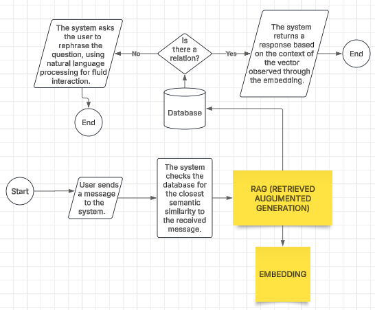
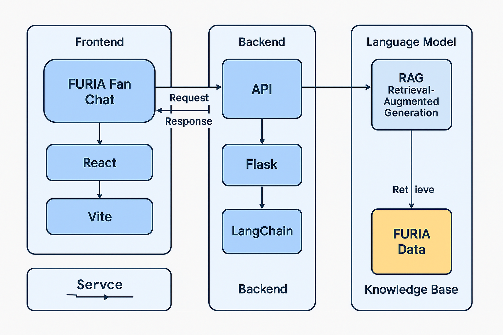

# 🐺 FURIA Chat App

Um **chat interativo para fãs da FURIA**, com integração futura a um sistema de **IA baseada em RAG (Retrieval-Augmented Generation)** para responder perguntas sobre a equipe com máxima precisão.

---

## 📚 Sumário

- [📌 Visão Geral](#visão-geral)
- [🧠 RAG: Retrieval-Augmented Generation](#rag-retrieval-augmented-generation)
- [🧱 Arquitetura do Projeto](#arquitetura-do-projeto)
- [🚀 Como Executar o Projeto](#como-executar-o-projeto)
  - [▶️ Backend (Flask)](#backend-flask)
  - [▶️ Frontend (React--vite)](#frontend-react--vite)
  - [💬 Acessar o Chat](#acessar-o-chat)
- [🔌 Detalhes da API](#detalhes-da-api)
- [📚 Roadmap](#roadmap)
- [🤝 Contribuição](#contribuição)
- [🛡️ Licença](#licença)

---

## 📌 Visão Geral

Este projeto tem como objetivo criar uma aplicação de chat interativa dedicada à comunidade da FURIA, utilizando inteligência artificial para responder perguntas sobre a organização, seus jogadores, história, conquistas e muito mais.

Abaixo segue o fluxograma de processos (diagrama de atividades) definido para a aplicação.



---

## 🧠 RAG: Retrieval-Augmented Generation

O projeto integrará a abordagem RAG (Retrieval-Augmented Generation) por meio da conexão com um modelo de linguagem de grande escala (LLM). Essa integração permitirá a recuperação de informações contextuais relevantes sobre a FURIA a partir de uma base vetorizada, fornecendo ao modelo dados precisos para gerar respostas mais coerentes, contextualizadas e assertivas. A seguir, apresenta-se uma representação visual deste fluxo de arquitetura:


---

## 🧱 Arquitetura do Projeto

- **Frontend**: Aplicação React (`furia-chat-app`), modificada para se comunicar com a API do backend.
- **Backend**: Aplicação Flask (`furia_backend`) que expõe uma API REST.
- **IA (placeholder)**: Implementação inicial de uma função `get_rag_response` que simula uma resposta gerada por IA.  
  > Esta função será substituída futuramente por uma integração real com o **Langchain** e uma base de conhecimento sobre a FURIA.

  

---

## 🚀 Como Executar o Projeto

### ✅ Pré-requisitos

- Python `3.10+`
- Node.js (`>= 16`) e `pnpm` (ou `npm` / `yarn`)
- (Opcional para uso de RAG real): API Key de um provedor de LLM (ex: OpenAI, Gemini, etc.)

---

### ▶️ Backend (Flask)

```bash
# Navegue até o diretório do backend
cd furia_backend

# Crie e ative o ambiente virtual (caso não exista)
python3 -m venv venv
source venv/bin/activate

# Instale as dependências
pip install -r requirements.txt

# Inicie o servidor Flask
python src/main.py
```

> O backend estará disponível em `http://localhost:5001` (ou na porta definida pela variável de ambiente `PORT`).

---

### ▶️ Frontend (React + Vite)

```bash
# Navegue até o diretório do frontend
cd furia-chat-app/furia-chat-app

# Instale as dependências
pnpm install

# Inicie o servidor de desenvolvimento
pnpm run dev
```

> O frontend estará acessível em `http://localhost:5173`.

---

### 💬 Acessar o Chat

1. Abra seu navegador e vá para `http://localhost:5173`
2. Envie mensagens no chat.
3. O frontend enviará as mensagens para o backend em `http://localhost:5001/api/chat`.
4. O backend responderá com a resposta da IA (atualmente um placeholder).

---

## 🔌 Detalhes da API

### Endpoint: `/api/chat`

- **URL:** `http://<backend_host>:<backend_port>/api/chat`
  - Exemplo: `http://localhost:5001/api/chat`
- **Método:** `POST`
- **Headers:**
  - `Content-Type: application/json`

---

### 📨 Corpo da Requisição

```json
{
  "message": "Qual é a lineup atual da FURIA?",
  "session_id": "abc123" // Opcional
}
```

---

### ✅ Resposta (200 OK)

```json
{
  "response": "A lineup atual da FURIA é..."
}
```

---

### ❌ Resposta de Erro

```json
{
  "error": "Ocorreu um erro ao processar a mensagem."
}
```

---

## 📚 Roadmap

- [x] Frontend com React funcional
- [x] Backend Flask com API REST básica
- [x] Placeholder de IA simulando respostas
- [ ] Integração com Langchain para RAG
- [ ] Base de conhecimento oficial da FURIA
- [ ] Deploy completo (Docker + CI/CD)
- [ ] Autenticação e sessões persistentes

---

## 🤝 Contribuição

Contribuições são bem-vindas!  
Se você tem ideias, sugestões ou quer ajudar a integrar o RAG real, sinta-se livre para abrir uma *issue* ou *pull request*.

---

## 🛡️ Licença

Este projeto está licenciado sob a [MIT License](LICENSE).
